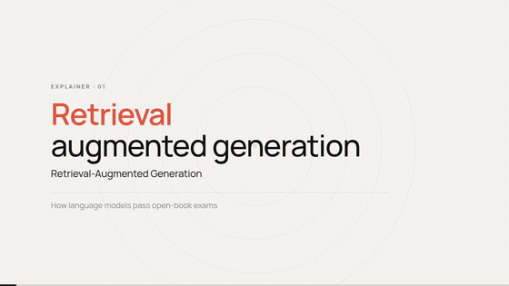
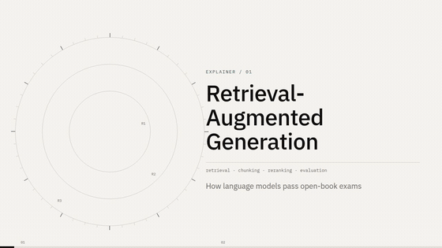
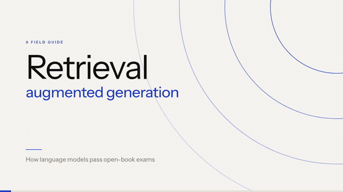

# anythingtoexplainer

**Topic in, narrated explainer film out.** An agent skill that turns any topic into a narrated
motion-graphics explainer video. English only. Every frame is drawn in code with
[Remotion](https://remotion.dev) (React + TypeScript): no stock footage, no generative video, no
frames from anyone else's work.

Three selectable style packs - **paper** (default), **instrument**, **poster** - one per film. The
skill asks which pack and how long (2-5 minutes) before it writes anything.

## Samples

The same 33-second RAG script, rendered by all three packs. Same narration, same shots - only
`config.style` changes.

### Paper (default)



[clip](examples/paper/sample.mp4) · [stills](examples/paper/frames/) · QC high 0 / mid 0 / low 2

### Instrument



[clip](examples/instrument/sample.mp4) · [stills](examples/instrument/frames/) · QC high 0 / mid 0 / low 1

### Poster



[clip](examples/poster/sample.mp4) · [stills](examples/poster/frames/) · QC high 0 / mid 0 / low 0

The Paper pack also ships a good/bad sheet for its four composition rules:
[`examples/paper-contrast/`](examples/paper-contrast/).

## What it does

- **Input**: a topic ("explain vector databases"), or an article or document to turn into a film.
  You also choose a style pack and a length.
- **Output**: a 1280x720 H.264 MP4 with voiceover, subtitles and a chapter progress bar, plus the
  paper trail: a sourced research note, the narration, the storyboard, per-shot source code, QC
  reports and the delivery notes.
- **How**: the agent researches with sources, writes the narration, synthesises the voiceover
  (kokoro-82m, local), storyboards every shot, then builds the shots and runs quantitative QC
  (`frame_metrics.py`, `motion_check.py`, `selfcheck.py`) against written criteria.
- **Objects, not placeholders**: when a film names a physical thing - headphones, a microphone, a
  temple, a crowd - the frame draws a recognisable object from parametric geometry (projection,
  wireframes, seeded repetition) rather than labelling an abstract stand-in
  ([`reference/drawing-objects.md`](reference/drawing-objects.md)). Organic subjects can use an
  imported picture with a licence note.
- **Time**: roughly 30-90 minutes of wall clock for a 3-5 minute film on a normal laptop.
- **Checkpoints**: the skill stops for style + duration, the narration, the voice and the first 30
  seconds.

## Quick start

```bash
bin/setup --yes                 # check the machine, create the venv, npm install
bin/setup doctor                # pass/fail report

# terminal: hand the prompt to whichever agent CLI is installed
bin/explain "vector databases" --style paper --minutes 3

# or the local UI: create a project, copy its prompt, watch progress
node ui/serve.mjs               # http://localhost:4173
```

Or install the skill and just ask your agent:

```bash
npx skills@latest add lankyjo/anythingtoexplainer --agent claude-code --agent opencode -y
```

Full instructions, per-OS prerequisites and troubleshooting: [`INSTALL.md`](INSTALL.md).

## The three packs

| Pack | Look | Guide | Contract |
|---|---|---|---|
| **paper** (default) | warm canvas, ink hairlines, one coral accent, concentric rings, dot matrices | [`reference/styles/paper.md`](reference/styles/paper.md) | |
| **instrument** | dial backdrop with ticks, mono readouts, teal data colour, Plex type | `src/styles/instrument/` | [`reference/style-guide.md`](reference/style-guide.md) |
| **poster** | cropped arcs, 124px extra-light headline, one committed blue, three objects per frame | `src/styles/poster/` | |

A pack owns its tokens, fonts, backdrop, chrome (title, chapter cards, HUD, subtitles, progress,
credit), primitives and demo; shot code imports from `src/ui.tsx` and never switches style itself.
Chrome timings are shared (`src/common/chromeSpec.ts`), so packs cannot drift apart. `config.subtitles`
can hide the subtitle band without changing the layout.

## How a film is made

`bin/explain` or the UI creates the project from `template/`, then the agent follows
[`SKILL.md`](SKILL.md): research (1 agent) -> narration and voiceover -> storyboard -> pilot shot
group -> parallel build groups -> render -> QC and fixes -> delivery notes. The written rules -
composition, motion budgets, narration, the storyboard format, agent protocols - live in
[`reference/`](reference/).

## Tools

| Path | Purpose |
|---|---|
| [`template/`](template/) | the Remotion project every film is scaffolded from (packs, chrome, camera, scripts) |
| [`template/scripts/`](template/scripts/) | voiceover + timeline, storyboard filling, stills, preview, render, three QC tools |
| [`reference/`](reference/) | style guide, pack guides, composition, motion vocabulary, narration, drawing objects, agent protocols, lessons |
| [`bin/setup`](bin/setup), [`bin/explain`](bin/explain) | environment check/install and film launcher |
| [`ui/`](ui/) | local companion page (Node built-ins only) |
| [`selftest.py`](selftest.py), [`ui/selftest.mjs`](ui/selftest.mjs) | runnable checks: language guard, width table, audio-vs-timeline, UI server |

## Licence

[PolyForm Noncommercial License 1.0.0](LICENSE). Noncommercial use is free; commercial use needs
prior authorization. Videos you make with the toolkit belong to you. Fonts are SIL OFL (see the
`OFL-*.txt` files in `template/public/fonts/`).

The original toolkit (Chinese-capable, black canvas) was created by
[Vincent Wei](https://github.com/Vincentwei1021); its licence notice is preserved in `LICENSE`.
This fork is an English-only rewrite with the three light packs above.
